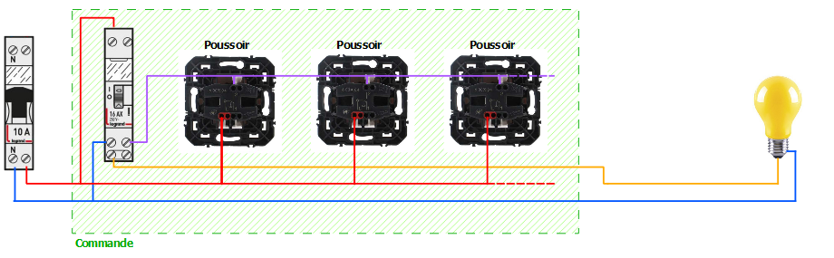

[some text](color: red)

Quack quack
<text color=red>ERROR</text>

# titre

Je vous propose dans ce guide, de vous expliquer comment domotiser les lumières de la maison tout en gardant en fonctionnement les interrupteurs existants pour ne pas être obligé de dégainer constamment son téléphone pour allumé une lumière ou tout simplement pour que les lumières continuent à fonctionner normalement même en cas de plantage de la domotique.
J'ai essayé d'écrire ce guide pour que même un débutant puisse s'y retrouver avec un minimum de matériel, aussi certaines parties pourront paraîtrent sans intérêt pour ceux ayant de bonnes connaisssances en électricité. 
  

## Le principe

Les cas les plus courants de branchement des lumières dans une maison sont les suivants.

**L'interrupteur simple** 
Un interrupteur pour commander un point lumineux

> *J'appelle point lumineux, une lumière seule ou un ensemble de lumières qui s'allument ensemble*

**Les interrupteurs en va et vient** 
Deux interrupteurs pour commander un point lumineux

**Les boutons poussoirs et télérupteur** 
Un ou plusieurs boutons poussoirs et un télérupteur pour commander un point lumineux (On retrouve ici deux possibilités)
Les boutons poussoirs avec phase

**Les boutons poussoirs avec neutre** 

Et pour finir un cas que l'on voit quand même moins souvent car remplacé, depuis pas mal de temps déjà, par les câblages avec télérupteurs
**Les interrupteurs en va et vient avec permutateur** 

On peut voir sur les schémas précédents que dans tous les cas nous avons :
* Une arrivée électrique symbolisée par le disjoncteur (à gauche sur les schémas)
* Un bloc de commande (encadré en vert)
* Un point lumineux

On notera que quel que soit la complexité de la commande, vu du côté de la lampe la commande se comportera toujours comme un seul interrupteur. On appui ça s'allume, on appui à nouveau ça s'éteint.

**Pour pouvoir domotiser tout ça, il faut donc rajouter un module (smart switch) entre le bloc de commande et le point lumineux.** 

  

## Choix du module
J'ai choisi pour ce guide des modules de chez sonoff
<table align="center">
<thead>
<tr align="center">
<th>
 <strong>Le ZBminiL2</strong>  
</th>
<th>
 <strong>Le ZBminiR2</strong>  
</th>
</tr>
</thead>
<tbody>
<tr align="center">
<td>

 <a href="https://sonoff.tech/product/diy-smart-switches/zbmini-l2/">La fiche produit du zbminil2</a>
</td>
<td>

 <a href="https://sonoff.tech/product/diy-smart-switches/zbminir2/">La fiche produit du zbminir2</a>
</td>
</tr>
</tbody>
<thead>
<tr align="center">
<th>
 <strong>Le MiniR4M</strong>  
</th>
<th>
 <strong>Le MiniR4</strong>  
</th>
</tr>
</thead>
<tbody>
<tr align="center">
<td>

 <a href="https://sonoff.tech/product/diy-smart-switches/minir4m/">La fiche produit du minir4m</a>
</td>
<td>

 <a href="https://sonoff.tech/product/diy-smart-switches/minir4/">La fiche produit du minir4</a>
</td>
</tr>
</tbody>
</table>
 

**Pourquoi ceux-ci et pas d'autres, me direz-vous ?**  
Parce que ce sont ceux que je connais le mieux, que j'ai pu avoir entre les mains pour certains d'entre eux.
Parce qu'ils acceptent sur leurs entrées aussi bien des interrupteurs que des boutons poussoirs et qu'ils peuvent se comporter sur leurs sorties comme des interrupteurs (les 4) ou comme des boutons poussoirs (à l'exception du ZBminiL2).

> [!note]
> Bien sur il est tout à fait possible de réaliser la même chose avec des modules d'autres marques à conditions qu'ils aient les mêmes possibilités que ceux présentés ici.
 

**Leurs différents schémas de câblage**  
ZBminiL2 

  

ZBminiR2, MiniR4M et MiniR4 

Ces schémas nous apprennent que pour pouvoir brancher les différents modules nous avons besoin d'identifier certains fils. 
La phase pour l'alimentation du module, le départ vers la lampe qui est également la sortie de " la commande " (interrupteur, va et vient etc...) dans le cas du ZBminiL2 et en plus le fil de neutre pour les 3 autres.
  

## Dans la pratique, comment faire 

C'est bien beau tous ces schémas car on voit tous les fils, mais en pratique on d'un côté le tableau électrique, le ou les boitiers d'encastrement avec les interrupteurs ou poussoirs et la lampe au plafond ou sur un mur.

Un seul point de commande 

> J'ai mis un fil bleu en pointillé dans la boite qui représente le fil de neutre car il n'est pas toujours présent. Je ne l'ai pas remis sur les schémas ci-dessous pour ne pas les surcharger

  
Deux (ou plus) point de commande 

  

**Comment s'y retrouver ?**
 

> [!CAUTION]
> Petit rappel ici, on ne joue pas avec l'électricité au risque dans le pire des cas d'y laisser la vie. Avant toute intervention dans le tableau électrique ou derrière une prise ou interrupteur on coupe le courant.

 
Je commence par identifier si mes points de commande sont des interrupteurs ou des boutons poussoirs. 
Pour ce faire il suffit d'appuyer dessus. Si une fois relâché il reste en position, c'est un interrupteur et si il revient à sa position initiale c'est alors un bouton poussoir. (Cela pourra aider pour paramétrer le module si besoin, ou encore appeler les choses par leurs noms en cas de question sur les forums). 
Dans le cas on l'on a des boutons poussoirs, c'est que l'on a forcément un télérupteur quelque part et il faudra également le retrouver. Celui peut être dans le tableau électrique mais on peut aussi en trouver dans des boites de dérivation dans les murs ou dans les combles.
  

Je vais à mon tableau électrique et je coupe le courant. 

Une fois le courant coupé je peux ouvrir mes interrupteurs ou poussoirs pour voir derrière ce que l'on va trouver comme fil et pouvoir les identifier. J’en profite pour faire une photo des différents branchements entre les fils et les interrupteurs. 

Je fais de même au niveau du ou des points lumineux pour voir les fils qui arrivent. 

Maintenant il va falloir identifier quel fil fait quoi. 

Si dans le cas d'un interrupteur simple c'est assez facile surtout si les couleurs de fil sont respectées cela peut vite devenir compliqué pour un débutant quand les couleurs ne correspondent pas au schémas et pire quand les fils sont tous de la même couleur (Déjà vu).
  

**Pour faire cette recherche nous allons avoir besoin d'un peu de matériel**
 

Des wagos ou domino. 
Une bonne longueur de fil. 
Du scotch d'électricien de préférence blanc. 
Un feutre ou stylo permettant d'écrire sur le scotch. 
Un multimètre (Avec la fonction continuité de préférence). 

  

## C'est parti !!!

**Commençons par le cas le plus simple avec un seul interrupteur** 
> [!CAUTION]
>Je rappelle que le courant est toujours coupé au tableau.

Je débranche les 2 fils présents sur mon interrupteur. 
Je mets mon multimètre en mode continuité et à l'aide de ces câbles je fais contact entre la borne de sortie phase du disjoncteur (Du circuit d'éclairage sur lequel je travaille) et un des fils coté interrupteur. 
Vous allez me dire mais les fils de mon multimètre ne sont pas assez longs pour aller du tableau électrique jusqu'à l'interrupteur. C'est là qu'entre en jeu les wagos et la bonne longueur de fil. 
On va faire une rallonge.

